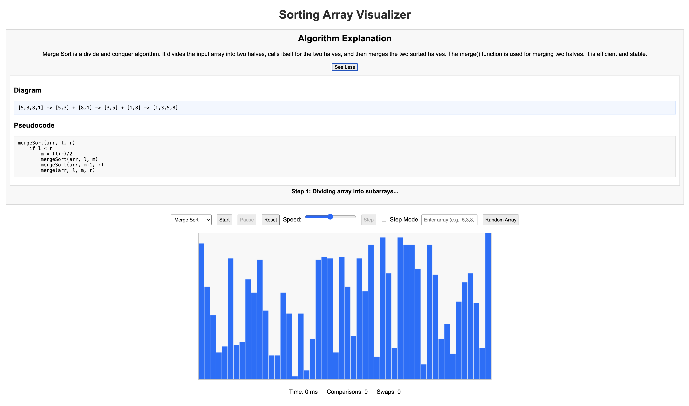

# Sorting Array Visualizer

A web-based educational tool that visualizes how sorting algorithms work in real-time. This project helps users understand the mechanics and efficiency of different sorting algorithms through interactive animations.

## Features

- Real-time visualization of array sorting using canvas-based bar charts
- Support for four fundamental sorting algorithms: Bubble Sort, Insertion Sort, Merge Sort, and Quick Sort
- Clear algorithm explanations with pseudocode and conceptual diagrams
- Adjustable animation speed via slider control
- Step-by-step execution mode for detailed learning
- Custom array input or random array generation
- Performance metrics tracking: execution time, comparisons, and swaps
- Comparison view to analyze efficiency differences between algorithms
- Responsive and intuitive user interface

## Requirements

- A modern web browser with JavaScript enabled
- No external dependencies or build tools required

## Installation

1. Clone or download the repository to your local machine.
2. Navigate to the project directory.
3. Open `index.html` in your web browser.

## Usage

### Basic Workflow

1. Select a sorting algorithm from the dropdown menu
2. Click "Start" to begin the animation
3. Adjust the speed slider to control animation pace
4. Use "Reset" to return to the initial unsorted array

### Custom Array Input

1. Enter comma-separated numbers in the input field (e.g., `5,3,8,1`)
2. Press Enter to load the custom array
3. Or click "Random Array" to generate a new random dataset

### Step-by-Step Mode

1. Check the "Step Mode" checkbox
2. Click "Start" to initialize the sorting
3. Click "Step" button to advance one operation at a time
4. Useful for analyzing each comparison and swap

### Algorithm Explanations

1. Select any algorithm to view its description
2. Click "See More" to expand and see the pseudocode and conceptual diagram
3. During sorting, "Step N" displays contextual information about the current operation

### Performance Comparison

1. Run multiple sorting algorithms on the same array or different arrays
2. Use the comparison table at the bottom to analyze:
   - Execution time in milliseconds
   - Total number of comparisons
   - Total number of swaps

## Supported Algorithms

### Bubble Sort

Repeatedly compares adjacent elements and swaps them if in wrong order. Simple but inefficient for large datasets.

Big O Notation:
- Best case: O(n) - when array is already sorted
- Average case: O(n^2)
- Worst case: O(n^2) - when array is reverse sorted
- Space complexity: O(1)

### Insertion Sort

Builds sorted array by inserting elements one at a time into correct position. Efficient for small datasets.

Big O Notation:
- Best case: O(n) - when array is already sorted
- Average case: O(n^2)
- Worst case: O(n^2) - when array is reverse sorted
- Space complexity: O(1)

### Merge Sort

Divides array in half, recursively sorts each half, then merges them. Predictable performance and stable sort.

Big O Notation:
- Best case: O(n log n)
- Average case: O(n log n)
- Worst case: O(n log n)
- Space complexity: O(n)

### Quick Sort

Selects pivot and partitions array around it, then recursively sorts partitions. Generally fastest in practice.

Big O Notation:
- Best case: O(n log n)
- Average case: O(n log n)
- Worst case: O(n^2) - when pivot selection is poor
- Space complexity: O(log n)

## Project Structure

```
Sorting_Arrays_Visualizer/
├── index.html       Main HTML file with canvas and UI elements
├── styles.css       Styling for layout, controls, and visualizations
├── script.js        Core logic: algorithms, visualization, and interactions
└── README.md        This file
```

## Files Description

**index.html**: Contains the page structure with:
- Algorithm selection dropdown
- Canvas element for visualization
- Control buttons (Start, Pause, Reset, Step)
- Speed slider and input fields
- Metrics display and comparison table

**styles.css**: Provides styling for:
- Layout and spacing
- Canvas and bar visualization
- Control elements and buttons
- Explanation panel with diagram and pseudocode areas
- Responsive table styling

**script.js**: Implements:
- Sorting algorithm generators using JavaScript generators
- Canvas rendering logic
- Event listeners for user interactions
- Metrics collection and tracking
- Step synchronization and explanation updates

## How It Works

1. Each sorting algorithm is implemented as a generator function that yields steps
2. Each step includes: which elements to highlight, metrics (comparisons/swaps)
3. The animation engine uses requestAnimationFrame for smooth visualization
4. Real-time metrics are calculated as the algorithm executes
5. Step annotations provide context-specific information during execution

## Browser Compatibility

Works with all modern browsers supporting:
- HTML5 Canvas API
- JavaScript ES6 (generators, arrow functions)
- CSS Grid and Flexbox

## Performance Notes

- Larger arrays (50+ elements) may take longer to sort
- Array size can be modified in the code by changing the `size` parameter in `generateRandomArray()`
- Speed slider allows adjustment of animation delay for better observation

## Educational Use

This tool is designed for:
- Computer science students learning sorting algorithms
- Visual learners who benefit from animations
- Algorithm analysis and comparison
- Understanding best and worst-case scenarios through observation

**GitHub Pages:**  
https://luiscontrerasglz.github.io/Sorting_Arrays_Visualizer/

